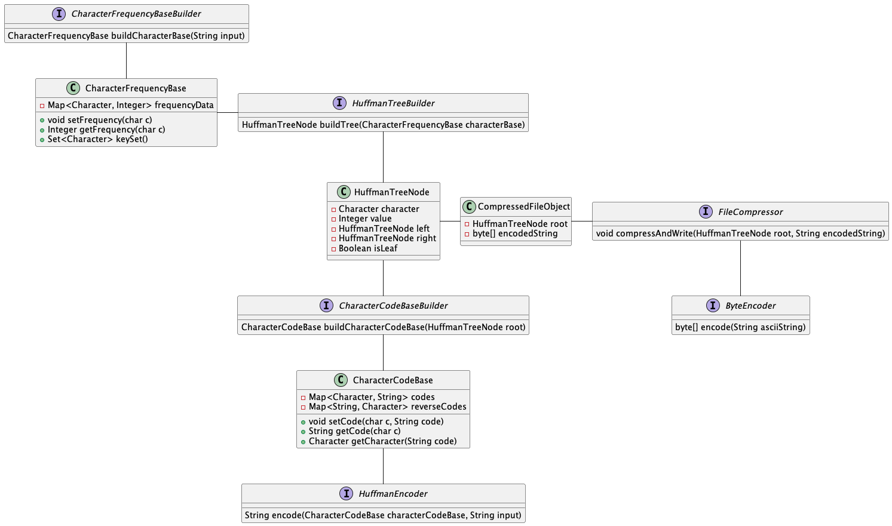
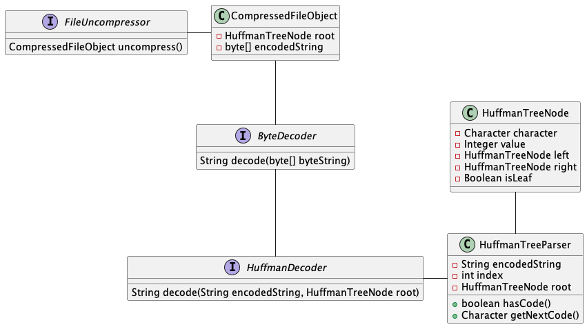
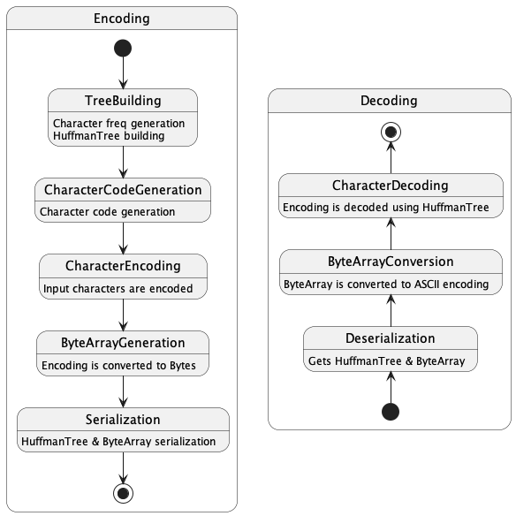

# text-compressor
A text compression tool written as part of Coding challenges

### Encoder
In Encoder, we take the plain-ascii string and encode it to 0's and 1's using the Huffman tree and convert it into a byte array.
Then we serialize the Object `CompressedFileObject`
containing the Tree with code information and the byte array of the encoding. The serialized object size is
significantly less in cases of large ascii files compared to small files as the tree information itself is
huge in the latter cases.<br><br>


### Decoder
In Decoder, we take the serialized file object and deserialize it to get the Encoding Tree and byte array of the encoding.
We then convert the byte array to a string of 0's and 1's. This string of 0's and 1's is then parsed using the Tree
whence we get the Decoded string.<br><br>


#### Process
The whole process of Encoding and Decoding is summarized below:<br><br>


### Sample Run

For the input
```commandline
Given there is usually an unequal distribution of character occurrences in text 
this can then be used to compress data by giving the most commonly occurring characters the shortest prefix.
```
The output looks as below
```commandline
Tree
{ 188 { 77 { 35 {e 17 _ _} { 18 {u 8 _ _} { 10 {m 4 _ _} { 6 {b 3 _ _} {y 3 _ _}}}}} { 42 { 20 {a 10 _ _} {o 10 _ _}} { 22 {n 11 _ _} {i 11 _ _}}}} { 
111 { 50 { 24 {c 12 _ _} {s 12 _ _}} { 26 { 13 { 6 { 3 {G 1 _ _} {p 2 _ _}} {g 3 _ _}} { 7 {d 3 _ _} { 4 {x 2 _ _} { 2 {. 1 _ _} {q 1 _ _}}}}} {r 13 _ _}}} 
{ 61 {  29 _ _} { 32 { 16 { 8 { 4 {f 2 _ _} {v 2 _ _}} {l 4 _ _}} {h 8 _ _}} {t 16 _ _}}}}}

CharacterCodeBase
{codes={G=1010000,  =110, a=0100, b=001110, c=1000, d=101010, e=000, f=1110000, g=101001, h=11101, i=0111, l=111001, 
m=00110, n=0110, .=10101110, o=0101, p=1010001, q=10101111, r=1011, s=1001, t=1111, u=0010, v=1110001, x=1010110, y=001111}}

encoded string
10100000111111000100001101101111111010001011000110011110011100010100100100100111001111001001111110010001101100010011000010101111001001001110011101010100111100
11111101101110011100010111101110101011011001011110000110100011101010010110100100011110001011110010110001000001010111011000011010000001001110011101101101111000
10101101111110111111101011110011101000010001101101111111010000110110001110000110001010010001010101101111010111010000101001101010001101100010011001110101010010
01111010011000111000111111010100101111110001011101101010011101111111010001100011001011001111111010000101001100011001010110111001001111110010110001000001010111
011011101101010011101000111010100101101001000111100010111001110111111101000110100111101010110111111000100111111101010001101100011100000111101011010101110

originalString
Given there is usually an unequal distribution of character occurrences in text this can then be used to compress data by giving the most commonly occurring 
characters the shortest prefix.
```

The difference of the `input.txt` and `decodedUncompressedText.txt` can be found using:
```commandline
$ diff input.txt decodedUncompressedText.txt
$
```

The size difference of the files is shown:
```commandline
3.2M input.txt (Original file)
1.8M output.txt (Compressed file)
3.2M decodedUncompressedText.txt (Uncompressed and decoded file)
```

## Benchmarks

For a file of size 3.8MB the below are benchmark results when performed using JMH
```commandline
Result "com.nagendar.learning.Main.testParseAndFormat":
  362.050 ±(99.9%) 12.464 ms/op [Average]
  (min, avg, max) = (358.297, 362.050, 365.863), stdev = 3.237
  CI (99.9%): [349.587, 374.514] (assumes normal distribution)

# Run complete. Total time: 00:01:42

Benchmark                Mode  Cnt    Score    Error  Units
Main.testParseAndFormat  avgt    5  362.050 ± 12.464  ms/op
```

File size 112MB the results are as follows:
```commandline
Result "com.nagendar.learning.Main.testParseAndFormat":
  17485.519 ±(99.9%) 4094.302 ms/op [Average]
  (min, avg, max) = (16391.416, 17485.519, 19102.437), stdev = 1063.277
  CI (99.9%): [13391.217, 21579.820] (assumes normal distribution)

# Run complete. Total time: 00:02:55

Benchmark                Mode  Cnt      Score      Error  Units
Main.testParseAndFormat  avgt    5  17485.519 ± 4094.302  ms/op
```

#### TODO
1. Try looking into loading very large files - chunks wise possibility